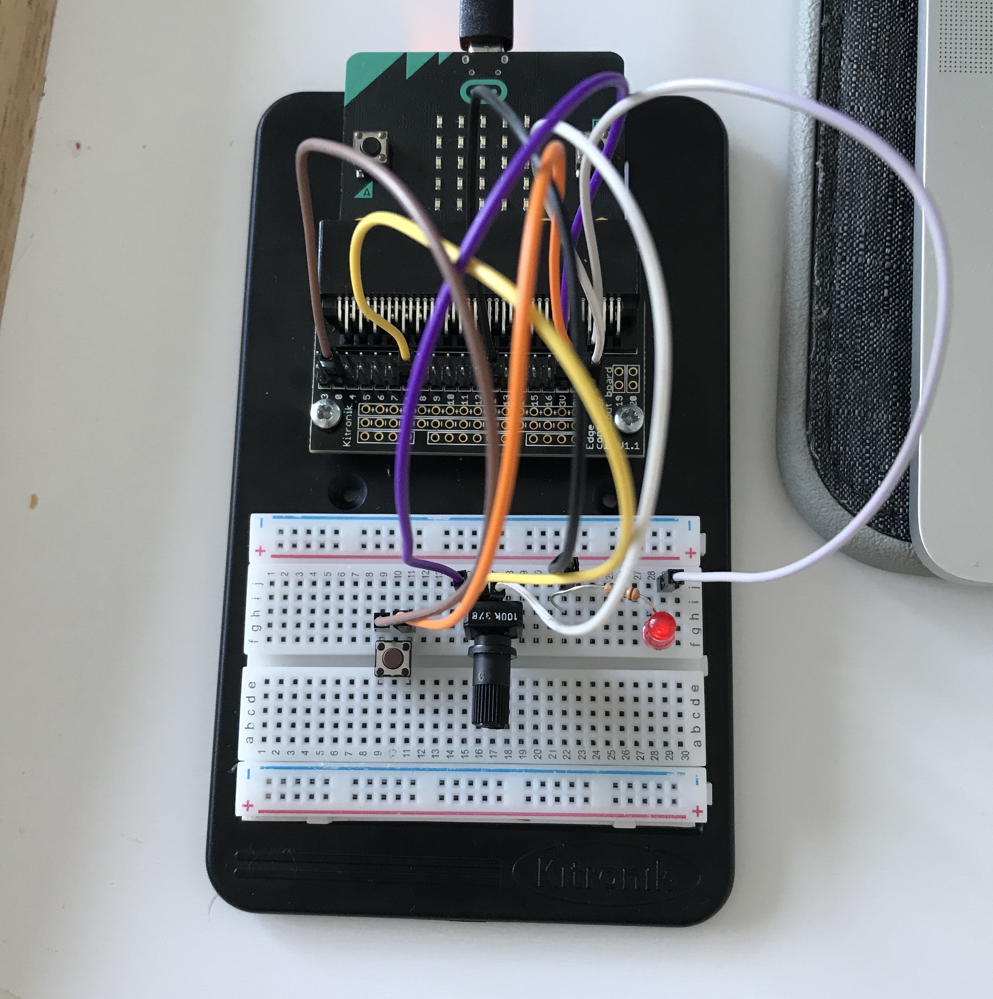
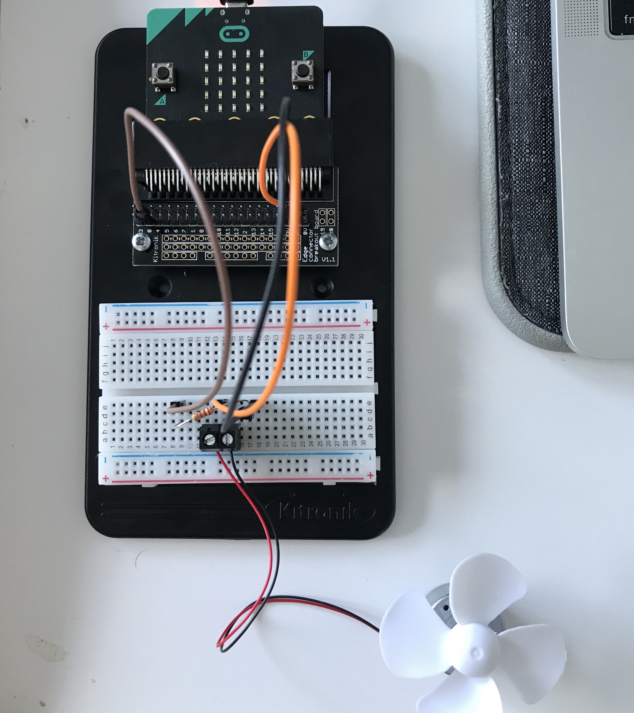
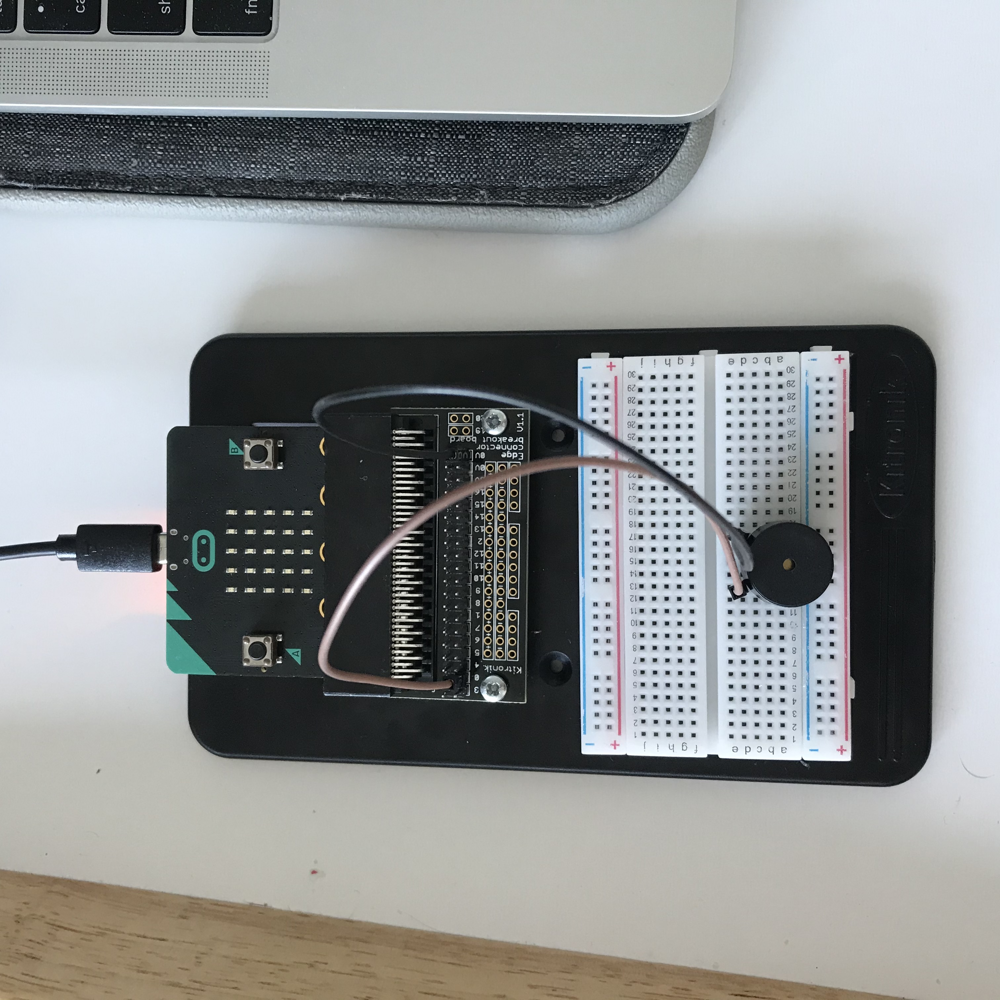
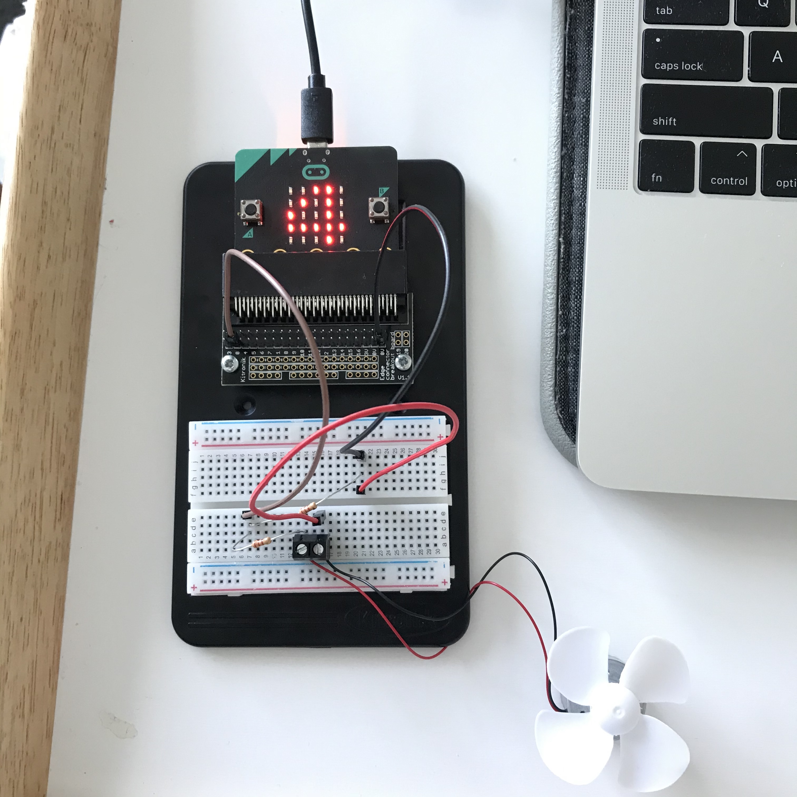
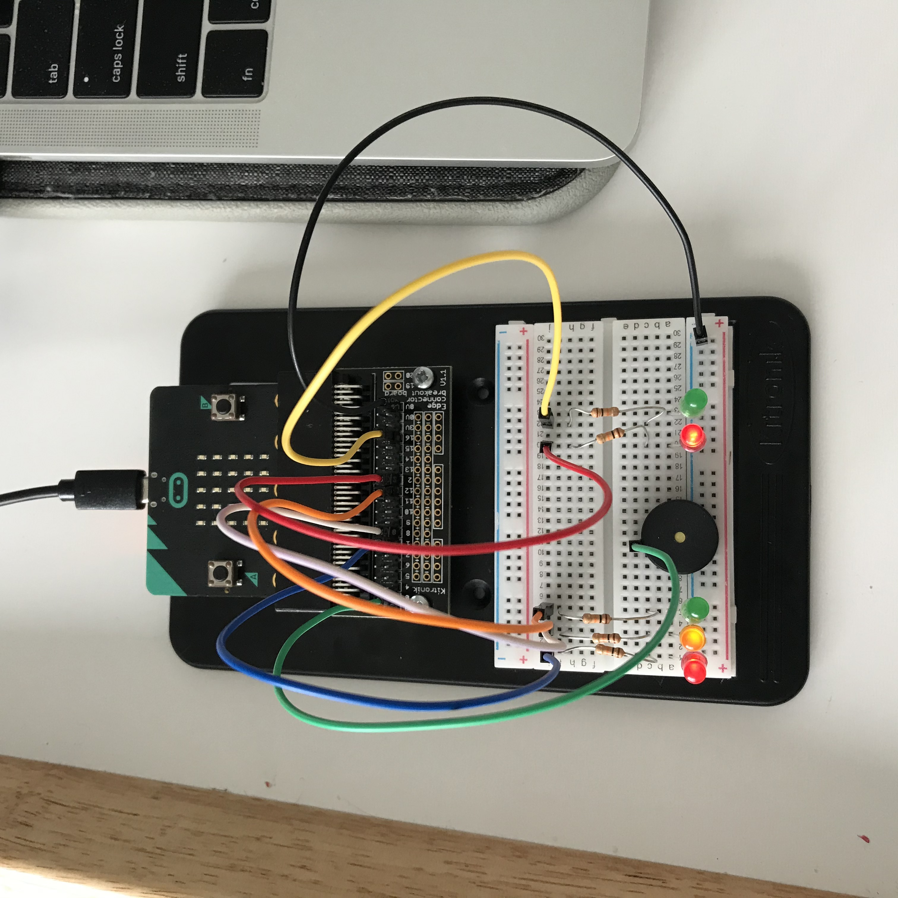

# Inventor Kit Experiments

*Markdown reference: https://guides.github.com/features/mastering-markdown/*

## Instructions ##

*For a selection of 5 inventor kit experiments that you choose, fill out the following sections.

### Experiment name ###

Dimming an Led using a Potentiometer

#### Photo of completed project ####
*In the code below, replace `missingimage.png` with the name of the image, which should be in the `kitexperiments` folder.*

 

This task focuses on the amount of light let in, or the dimming of a light using a potentiometer. The potentiometer is rotated clockwise to dim and anti clockwise to brighten. This is possible with the coding, setting the 'light state' variable to 1 when turned on. The light state is on a forever loop and when the knob is rotated, it sends the infomation to the output, which determines the brightness of the light. 

#### Reflection ####

In this experiment, I learnt how this whole concept works with the coding and building. A key aspect I learnt about was the purpose of the resistor and what it does. The resistor controls the amount of power sent to somthing and in this case it was the LED light. I experimented with this and removed the resistor and it allowed for a much brighter output in the light. Diffrent types of resistors contain more or less output depending on what is being used and what the project it. 

This experiment could be the basis of a real world application as seen in many house holds with indoor and outdoor lighting. This concept is seen in households as a knob is rotated to control the dimness or brightness of lights.  

### Experiment name ###

Using a Transistor to Drive a Motor

#### Photo of completed project ####
In the code below, replace imagemissing.jpg with the name of the image, which should be in the kitexperiments folder.

This task focuses on using a transistor to drive a motor attached to a fan, to spin on a duty cycle. The fan will start to spin slowly, then quickly then it will stop and start the cycle again. Use the transistor, the motor is controlled with pulse width modulation (PWM). The code works by increasing the speed and writting this infomation on P0, until it reaches full speed. Then it decreasses writting the code onto the P0 until it stops. 

#### Reflection ####

In this experiment, I learnt how to create this project and how it works. I learnt about the transistor and how it can allow more power/current to the microbit. I found this interesting, as I will most likely need to use this and consider a transistor for my main project.  

This experiment could be the basis of a real world application such as with toys, programed fans or cooling systems. 

### Experiment name ###

Setting the Tone with a Piezo Buzzer

#### Photo of completed project ####
In the code below, replace imagemissing.jpg with the name of the image, which should be in the kitexperiments folder.

This task uses a signal from coding that comunicates voltage from 03 - 3V that gives off a frequency of tone. When pressing button A the buzzer plays a tone with a frequency of 400 for 500 milliseconds. When button B is pressed the buzzer will play a diffrent tone coded into the micro bit. Then when both buttons are pressed the buzzer will set off a tune.

#### Reflection ####

In this experiment, I learnt about Piezo Buzzers and how they work. Through voltage they create a frequency to play tones and tunes. I learnt that you can program the buzzer with a frequency amount eg. 400Hz or you can program the buzzer to play a particular tone eg. middle c. This buzzer may be useful for my first assinment. 

This experiment can be seen in real world applications with diffrent toys, systems using buttons eg. door bells.

### Experiment name ###

Wind Power

#### Photo of completed project ####
In the code below, replace imagemissing.jpg with the name of the image, which should be in the kitexperiments folder.

This experiment the fan is blown onto, to create energy/voltage, which comunicated back to the micro bit to display a number a of the measured about of voltage produced. This number is shown once button A is pressed, the number is in a range of 1-5 (5 being the most voltage). When blowing on the fan the voltage transmitted will be any where from 0 - 1023. 

#### Reflection ####

In this experiment, I learnt how to create the code and assemble this project, i learnt hoe it operates and i learnt about writing up the code in JAVA script. This was the first time i ever wrote uo the code manually. I was interesting to see the code stripped back and how it all works together. 

This experiment could be the basis of a real world application such as in wind power plants or with anything powered by wind power. 

### Experiment name ###

Pedestrian Crossing

#### Photo of completed project ####
In the code below, replace imagemissing.jpg with the name of the image, which should be in the kitexperiments folder.

this experiment replicated a crossing, useing red, orange, and green lights as traffic lights, and red and green lights as crossing lights. This project outputs 6 diffrent comands to the lights and to the buzzer to replicate a traffic intersection. When button A is pressed the lights go from green, to orange, to red. The pedestrian lights changes from red to green to show that it is safe to cross, while the buzzer beeps eight times. Then the lights reset back to the default. 

#### Reflection ####

In this experiment, somthing new to me was using multiple LED lights and creating so many output comands. This was also a chance for me to learn the code for this experiment and how to build it. 

This experiment could be the basis of a real world application such as at traffic intersections and with toys and games.

