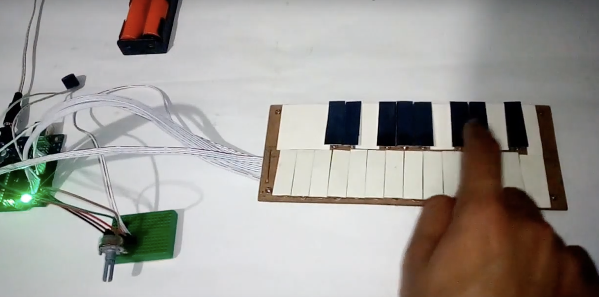

# Assessment 1: Replication project

*Fill out the following workbook with information relevant to your project.*

*Markdown reference:* [https://guides.github.com/features/mastering-markdown/](http://guides.github.com/features/mastering-markdown/)

## Replication project choice ##
Banana Keyboard

## Related projects ##
*Find about 6 related projects to the project you choose. A project might be related through  function, technology, materials, fabrication, concept, or code. Don't forget to place an image of the related project in the* `replicationproject` *folder and insert the filename in the appropriate places below. Copy the markdown block of code below for each project you are showing, updating the number* `1` *in the subtitle for each.*

### Related project 1 ###
How to Make Arduino Piano | Arduino based Piano | Electronic Projects

https://www.youtube.com/watch?v=eKWk9RIGVxg

This project is related to mine because it uses the same piano concept and a similar coding concept. This example is interesting as they were able to create a entire mini piano with alot of the diffrent keys and notes. What is also interesting is how they were able to apply the project and refine it to look and function like an piano. This might be an element to add to the original banana keyboard, instead of using fruit. 

### Related project 2 ###
Adafruit Capacitive Touch HAT for Raspberry Pi - Mini Kit - MPR121

https://www.youtube.com/watch?v=Wk76UPRAVxI

This project is related to mine because it uses the same piano concept. What is diffrent and interesting about this example is how creative she is with using random and diffrent objects. She also expanded on the number of conductors there were, but how could I apply this with my project only using a micro bit? What elements could i use to make the project more interesting and original?

### Related project 3 ###
Sound Art - Focus and Hear the Arts

https://www.widewalls.ch/sound-art/

This project is related to mine because it uses a focus on sound. This project focuses on experiencing sound from all around. This site shows many examples but this example in particular stood out to me because of the placment of the speakers. The speakers are placed around everybody and immurses them in the project. This makes me consider incorperating this method into my project. 

### Related project 4 ###
Cuerdos

https://mario-lorenzo.com/fr/cuerdos/

This project is related to mine because it focuses of interacting with sound. This project is a roange of speakers possitioned along wires on a wall. People can interact with the wires by touching them, which then triggers tones to play from the speakers in that area. The use on conductors with this interaction is very interesting, it looks very ingaging. 

### Related project 5 ###
An Interactive Sound Wall

https://www.bareconductive.com/news/a-conductive-sound-wall/

This project is related to mine because it focuses of interacting with sound. This project is a wall with speakers painted on all over it. The speakers have touch points at all the buttons and switches painted on. These are then connected to coding that respondes to the button they pressed, playing music, turning the volume up or down etc. This is somthing that I could apply to my project or even use to inspire my main project. 

### Related project 6 ###
How To Make Buzzer Game For Kids - Challenge Yourself

https://www.youtube.com/watch?v=ZsoiMZLkK1Y

This project is related to mine because it incorperates a peizo buzzer when interacting with an object. This video show cases a game that triggers a peizo buzzer to make tones and for a LED light to light up. This could be somthing I incorparate into my design instead of using a speaker or headphones. 

## Reading reflections ##
*Reflective reading is an important part of actually making your reading worthwhile. Don't just read the words to understand what they say: read to see how the ideas in the text fit with and potentially change your existing knowledge and maybe even conceptual frameworks. We assume you can basically figure out what the readings mean, but the more important process is to understand how that changes what you think, particularly in the context of your project.*

*For each of the assigned readings, answer the questions below.*

### Reading: Don Norman, The Design of Everyday Things, Chapter 1 (The Psychopathology of Everyday Things) ###

*What I thought before: Describe something that you thought or believed before you read the source that was challenged by the reading.* Prior to this reading I never considered the importants of the experince its self, wether its negative or positive. I always thought and focused on the overal product and the asethetics as I am a graphic design major. 

*What I learned: Describe what you now know or believe as a result of the reading. Don't just describe the reading: write about what changed in YOUR knowledge.* From this chapter I learnt about the term 'Affordance' and what that means within designing. Prior to this reading I was never aware of this term and how it applied to this course. I now know that it is important to consider the relationships between the properties of an object and the capabilities of how that object can be put in use. This has made me aware that when designing i need to consider how people will engage with my project, will if be understood? Will people naturally know what to do? Will it be invisable or obvious? What are the signs and signifiers? these are now all questions I will consider when designing my product.

*What I would like to know more about: Describe or write a question about something that you would be interested in knowing more about.* From reading this chapter I would be interested in learning more about key signifiers and key mapping elements when producing projects in this type of design.

*How this relates to the project I am working on: Describe the connection between the ideas in the reading and one of your current projects or how ideas in the reading could be used to improve your project.* This reading really relates to my project when considering how people will interact and how they will understand my project. This reading has helped me to consider many new elements to better my design and make it as positivly interactive as possible. 

### Reading: Chapter 1 of Dan Saffer, Microinteractions: Designing with Details, Chapter 1 ###

*What I thought before: Describe something that you thought or believed before you read the source that was challenged by the reading.*

*What I learned: Describe what you now know or believe as a result of the reading. Don't just describe the reading: write about what changed in YOUR knowledge.*

*What I would like to know more about: Describe or write a question about something that you would be interested in knowing more about.*

*How this relates to the project I am working on: Describe the connection between the ideas in the reading and one of your current projects or how ideas in the reading could be used to improve your project.*

### Reading: Scott Sullivan, Prototyping Interactive Objects ###

*What I thought before: Describe something that you thought or believed before you read the source that was challenged by the reading.* Before reading this chapter I did not have the perspective that this type of design involves synthesiszing, problem solving and simplifying. This chapter made me very aware of that process and its importance in making good designs. 

*What I learned: Describe what you now know or believe as a result of the reading. Don't just describe the reading: write about what changed in YOUR knowledge.* From reading about the case study of Capybara, I learnt that projects like this are used with the purpose of providing infomation for things like store layout, product placment aswell as monitoring foot traffic. I was never aware or thought that extensive teach projects like this would/ could be used for things like setting up a effective store layout. This reading helped me gain knowledge of how this sort of project can be resourceful in many diffrent situations no matter how small or large. This reading broadened my knowledge of how this sort of technology can be used.

*What I would like to know more about: Describe or write a question about something that you would be interested in knowing more about.* I would be interested in knowing more about how these sort of projects can apply to more and diffrent types of real world scenarios.

*How this relates to the project I am working on: Describe the connection between the ideas in the reading and one of your current projects or how ideas in the reading could be used to improve your project.* This reading allowed me to really broaden my view on coming up with projects. This reading was also interesting in seeing how practical and benifical this project was, this makes me wonder if I should focus on making my projects more practical for day to day life. 

## Interaction flowchart ##
*Draw a flowchart of the interaction process in your project. Make sure you think about all the stages of interaction step-by-step. Also make sure that you consider actions a user might take that aren't what you intend in an ideal use case. Insert an image of it below. It might just be a photo of a hand-drawn sketch, not a carefully drawn digital diagram. It just needs to be legible.*

## Process documentation

*In this section, include text and images that represent the development of your project including sources you've found (URLs and written references), choices you've made, sketches you've done, iterations completed, materials you've investigated, and code samples. Use the markdown reference for help in formatting the material.*

*This should have quite a lot of information!*

*There will likely by a dozen or so images of the project under construction. The images should help explain why you've made the choices you've made as well as what you have done. Use the code below to include images, and copy it for each image, updating the information for each.*

*Include screenshots of the code you have used.*

## Project outcome ##

*Complete the following information.*

### Project title ###

### Project description ###

*In a few sentences, describe what the project is and does, who it is for, and a typical use case.*

### Showcase image ###

*Try to capture the image as if it were in a portfolio, sales material, or project proposal. The project isn't likely to be something that finished, but practice making images that capture the project in that style.*

### Additional view ###

*Provide some other image that gives a viewer a different perspective on the project such as more about how it functions, the project in use, or something else.*

### Reflection ###

*Describe the parts of your project you felt were most successful and the parts that could have done with improvement, whether in terms of outcome, process, or understanding.*

*What techniques, approaches, skills, or information did you find useful from other sources (such as the related projects you identified earlier)?*

*What ideas have you read, heard, or seen that informed your thinking on this project? (Provide references.)*

*What might be an interesting extension of this project? In what other contexts might this project be used?*
