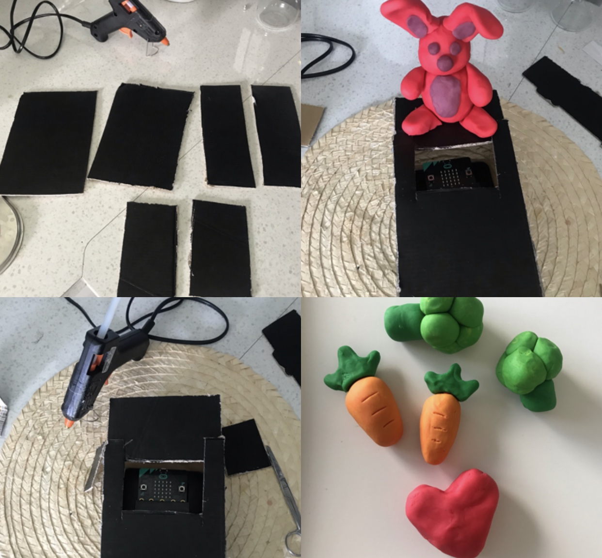
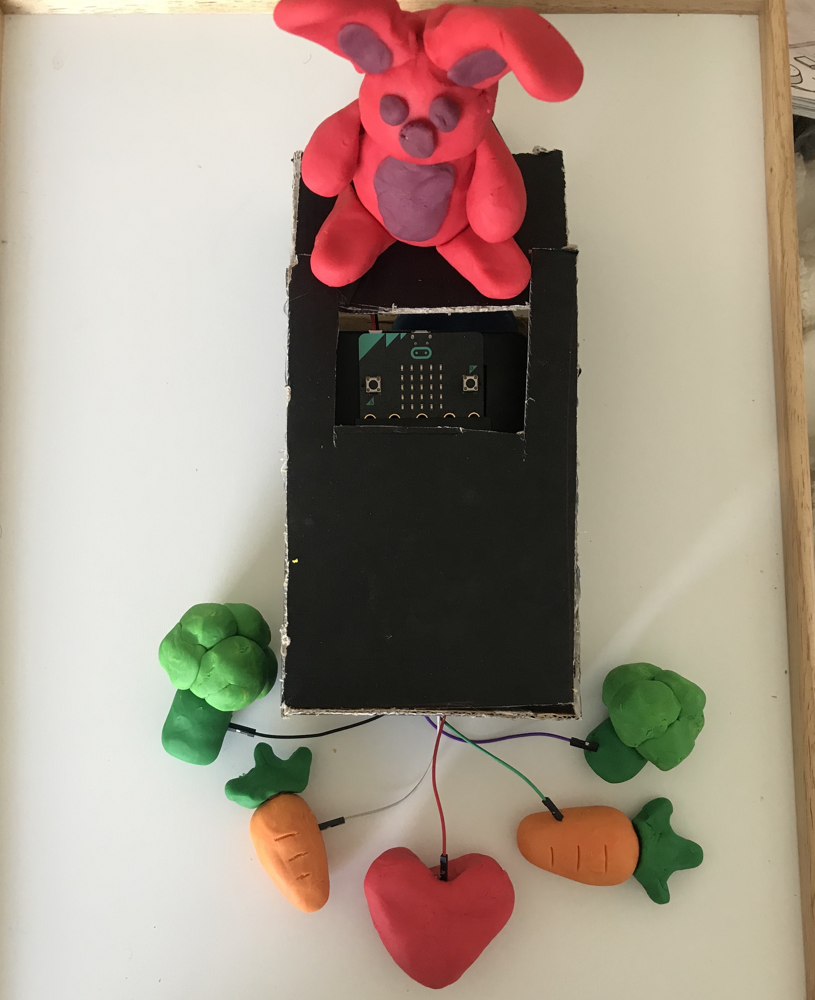

# Assessment 1: Replication project

*Fill out the following workbook with information relevant to your project.*

*Markdown reference:* [https://guides.github.com/features/mastering-markdown/](http://guides.github.com/features/mastering-markdown/)

## Replication project choice ##
Banana Keyboard

## Related projects ##
*Find about 6 related projects to the project you choose. A project might be related through  function, technology, materials, fabrication, concept, or code. Don't forget to place an image of the related project in the* `replicationproject` *folder and insert the filename in the appropriate places below. Copy the markdown block of code below for each project you are showing, updating the number* `1` *in the subtitle for each.*

### Related project 1 ###
How to Make Arduino Piano | Arduino based Piano | Electronic Projects

https://www.youtube.com/watch?v=eKWk9RIGVxg

This project is related to mine because it uses the same piano concept and a similar coding concept. This example is interesting as they were able to create a entire mini piano with alot of the diffrent keys and notes. What is also interesting is how they were able to apply the project and refine it to look and function like an piano. This might be an element to add to the original banana keyboard, instead of using fruit. 

### Related project 2 ###
Adafruit Capacitive Touch HAT for Raspberry Pi - Mini Kit - MPR121

https://www.youtube.com/watch?v=Wk76UPRAVxI

This project is related to mine because it uses the same piano concept. What is diffrent and interesting about this example is how creative she is with using random and diffrent objects. She also expanded on the number of conductors there were, but how could I apply this with my project only using a micro bit? What elements could i use to make the project more interesting and original?

### Related project 3 ###
Sound Art - Focus and Hear the Arts

https://www.widewalls.ch/sound-art/

This project is related to mine because it uses a focus on sound. This project focuses on experiencing sound from all around. This site shows many examples but this example in particular stood out to me because of the placment of the speakers. The speakers are placed around everybody and immurses them in the project. This makes me consider incorperating this method into my project. 

### Related project 4 ###
Cuerdos

https://mario-lorenzo.com/fr/cuerdos/

This project is related to mine because it focuses of interacting with sound. This project is a roange of speakers possitioned along wires on a wall. People can interact with the wires by touching them, which then triggers tones to play from the speakers in that area. The use on conductors with this interaction is very interesting, it looks very ingaging. 

### Related project 5 ###
An Interactive Sound Wall

https://www.bareconductive.com/news/a-conductive-sound-wall/

This project is related to mine because it focuses of interacting with sound. This project is a wall with speakers painted on all over it. The speakers have touch points at all the buttons and switches painted on. These are then connected to coding that respondes to the button they pressed, playing music, turning the volume up or down etc. This is somthing that I could apply to my project or even use to inspire my main project. 

### Related project 6 ###
How To Make Buzzer Game For Kids - Challenge Yourself

https://www.youtube.com/watch?v=ZsoiMZLkK1Y

This project is related to mine because it incorperates a peizo buzzer when interacting with an object. This video show cases a game that triggers a peizo buzzer to make tones and for a LED light to light up. This could be somthing I incorparate into my design instead of using a speaker or headphones. 

## Reading reflections ##
*Reflective reading is an important part of actually making your reading worthwhile. Don't just read the words to understand what they say: read to see how the ideas in the text fit with and potentially change your existing knowledge and maybe even conceptual frameworks. We assume you can basically figure out what the readings mean, but the more important process is to understand how that changes what you think, particularly in the context of your project.*

*For each of the assigned readings, answer the questions below.*

### Reading: Don Norman, The Design of Everyday Things, Chapter 1 (The Psychopathology of Everyday Things) ###

*What I thought before: Describe something that you thought or believed before you read the source that was challenged by the reading.* Prior to this reading I never considered the importants of the experince its self, wether its negative or positive. I always thought and focused on the overal product and the asethetics as I am a graphic design major. 

*What I learned: Describe what you now know or believe as a result of the reading. Don't just describe the reading: write about what changed in YOUR knowledge.* From this chapter I learnt about the term 'Affordance' and what that means within designing. Prior to this reading I was never aware of this term and how it applied to this course. I now know that it is important to consider the relationships between the properties of an object and the capabilities of how that object can be put in use. This has made me aware that when designing i need to consider how people will engage with my project, will if be understood? Will people naturally know what to do? Will it be invisable or obvious? What are the signs and signifiers? these are now all questions I will consider when designing my product.

*What I would like to know more about: Describe or write a question about something that you would be interested in knowing more about.* From reading this chapter I would be interested in learning more about key signifiers and key mapping elements when producing projects in this type of design.

*How this relates to the project I am working on: Describe the connection between the ideas in the reading and one of your current projects or how ideas in the reading could be used to improve your project.* This reading really relates to my project when considering how people will interact and how they will understand my project. This reading has helped me to consider many new elements to better my design and make it as positivly interactive as possible. 

### Reading: Chapter 1 of Dan Saffer, Microinteractions: Designing with Details, Chapter 1 ###

*What I thought before: Describe something that you thought or believed before you read the source that was challenged by the reading.* Prior to reading this document, I was unaware and challenged that all the icons and pieces of interaction in a smart device or any tech device are grouped under microinteractions. I never thought that they were categorised and recognised as a type of element in technology.  

*What I learned: Describe what you now know or believe as a result of the reading. Don't just describe the reading: write about what changed in YOUR knowledge.* From this reading I learnt all about 'microinteractions' what they are and how they function with in a product. I learn that microinteractions are a function that only has one purpose and only does one thing. I learnt that a whole product can be made up of them and most the time they are just a small function alongside another element in the product.

*What I would like to know more about: Describe or write a question about something that you would be interested in knowing more about.* From this reading I would be more interested in knowing how I can apply this to future designing and even to these projects.   

*How this relates to the project I am working on: Describe the connection between the ideas in the reading and one of your current projects or how ideas in the reading could be used to improve your project.* This ready has given insight to help with my projects, by making me aware of microinteractions and how much of a infulence they have on the design. This reading makes me aware of how I can make each step of the interation smooth and allow users to get the most out of the design.  

### Reading: Scott Sullivan, Prototyping Interactive Objects ###

*What I thought before: Describe something that you thought or believed before you read the source that was challenged by the reading.* Before reading this chapter I did not have the perspective that this type of design involves synthesiszing, problem solving and simplifying. This chapter made me very aware of that process and its importance in making good designs. 

*What I learned: Describe what you now know or believe as a result of the reading. Don't just describe the reading: write about what changed in YOUR knowledge.* From reading about the case study of Capybara, I learnt that projects like this are used with the purpose of providing infomation for things like store layout, product placment aswell as monitoring foot traffic. I was never aware or thought that extensive teach projects like this would/ could be used for things like setting up a effective store layout. This reading helped me gain knowledge of how this sort of project can be resourceful in many diffrent situations no matter how small or large. This reading broadened my knowledge of how this sort of technology can be used.

*What I would like to know more about: Describe or write a question about something that you would be interested in knowing more about.* I would be interested in knowing more about how these sort of projects can apply to more and diffrent types of real world scenarios.

*How this relates to the project I am working on: Describe the connection between the ideas in the reading and one of your current projects or how ideas in the reading could be used to improve your project.* This reading allowed me to really broaden my view on coming up with projects. This reading was also interesting in seeing how practical and benifical this project was, this makes me wonder if I should focus on making my projects more practical for day to day life. 

## Interaction flowchart ##
*Draw a flowchart of the interaction process in your project. Make sure you think about all the stages of interaction step-by-step. Also make sure that you consider actions a user might take that aren't what you intend in an ideal use case. Insert an image of it below. It might just be a photo of a hand-drawn sketch, not a carefully drawn digital diagram. It just needs to be legible.*

## Process documentation

*In this section, include text and images that represent the development of your project including sources you've found (URLs and written references), choices you've made, sketches you've done, iterations completed, materials you've investigated, and code samples. Use the markdown reference for help in formatting the material.*

*This should have quite a lot of information!*

*There will likely by a dozen or so images of the project under construction. The images should help explain why you've made the choices you've made as well as what you have done. Use the code below to include images, and copy it for each image, updating the information for each.*

For this task I began by replicating the base project. This helped me get a understanding of how it worked and what it did. This just allowed me to get a better understanding of what I need to do to for this assignment. 

Image of the code for the base project that I recreated.

Next Next I began looking at changes and improvements I could make.
I first began with solving the issue of creating this project without the use of crocodile clips. The original exampled used these to connect all the elements, but I did not have any in my kit and I was also recommended to to use them. So I began playing around with adapting this design to work through the bread board with jump wires. I connected the sound outputs to the 0V and 0. Then the connections to the fruit where on 1 and 2 and then the connection to loop everything together was connected to 0V as well.

Image of jump wire connections 

Next I decided to add in another wire to both connectors 1 and 2. This allows for more elements to interact with. 

Image of other inputs attached.

The next element I looked at was changing the sound. The original used a headphone jax, but I did not like this idea, as it made to sound output a lot quieter and not as neat and affective. I looked into experimenting with other options. I first looked at using a speaker. I found some extra wire to connect to a jax on the speaker and then to the jump wires. This did not work well, as it was very touchy and did not connect properly. I came to the conclusion that I wouldn’t use this connection, as it would not be practical and would fall apart.  

Image of wire connecting to speaker jax. 

Instead I choose to look into using a Piezo buzzer. This allowed for the same tone and tune output and is more practical and secure, this element was also simple to attach. Although the buzzer produces sound output differently (creating frequency through voltage) I was still able to produce the same sound outcome as a speaker or headphone jax. 

Image of Piezo buzzer hooked up to the project.

To trial the buzzed in connected the fruit to the wires. 

Image of Piezo buzzer trialed in project.

 Next I looked at changing the coding. From trailing the buzzer I discovered that the original coding is still functional with the buzzer, so I then went on to adding and changing different elements with in the code. Firstly I began to change the sounds and tones. I played around with what tone to set the code to. I decided to go with middle F. 

Image of selecting a tone for the start of the code.

From here I started changing and playing around with different settings on both P1 and P2. With P1 I changed the repeat time down to 2 after playing around with a few different options. I changed the sound increase by 75 and then set the sound back to middle F. 

Image of P1 code. 

Next I made changes to P2. I made this pin a bit different to P1 to make to sound output more interesting and engaging. I increased the repeat to 3 times and changed the sound variable by -75 and then set it back to middle F. 

Image of P1 and P2 coding.

Image of the entire code at this point in the process. 

Next I wanted to add another element to make the project more engaging and a bit different. To do this I added in ‘Leds’ of musical notes. These notes were added to the code to appear and show a different image depending on what pin is pressed. 

Image of led images added to the code.

From here I began to sketch a new concept as I decided to add and change the project a bit more. I draw up sketches and came up with a final outcome. I decided to change the concept of the piano to a interactive toy. Through the sketching I choose what materials to uses and what the project would look like. I decided to use playdoh and cardboard to construct the project. The Playdoh will work as the conductor, it will also allow me to make the elements and be creative with it. The cardboard is what will be used to cover the bread board and make it look more refined.  

Image of sketches. 

From here I then assembled the project. I firstly measured and cut pieces of cardboard to create the box. Next I hot glued all the pieces together. From there I created all the playdoh elements, starting with the rabbit and then the carrots, broccoli and the heart. 

Lastly I made some changes. From coming up with this concept, I decided to change the images on the micro bit. When the carrot is touched a smile will appear and when the brocoli and touch a sad face will appear. As wll as these changes, I also change the varible nuber that increases/ decreases the sound to 25 and -25.

## Project outcome ##

### Project title ###
Banana Keyboard / happy/sad Bunny

### Project description ###

This project was transformed into a interactive kids toy. In this project if you touch/hold the heart and then press either a carrot or a broccoli, the micro bit in front of the rabbit will light up with a reaction and play a tune. If the carrot is touched it will play a more hight pitched/ happy tune and display a smily face. If the broccoli and heart are touched, a low/ sad tune and a sad face will appear. If both the carrot and the broccoli and touched together with the heart, a longer tune will play and the micro bit screen with flash between the happy and sad face. 

### Showcase image ###

### Additional view ###

### Reflection ###
Through this project I thought the overall look of the project was very successful, as well as the purpose and function behind the idea of the project. When comparing this outcome to the banana keyboard, this project is a lot more refined and creative, also making this project more interesting and engaging. This is due to the use of the playdoh as a conductor, allowing for more creativity when constructing. The micro bit is also hidden away making the project look a lot neater and more like a toy project. The project also conveys a clear purpose, with all the elements working together to make this project/object more engaging. What could of been improved is the construction and of the box and the structure of the project. Some of the wires were hard to keep attached and in the right location, refining this more would of been ideal. This could of also been improved if I was able to figure out a way to have more options with different outcomes. I dont know if i could change that, but this could of been discovered with more work and understanding in the process and research. 

Through this project I found interesting approaches and information that helped influence the outcome of this project. When looked through examples in the previous section, I discovered a few people recreating the banana keyboard with other conductors. This lead me to learn about other things I could use and how broad this can be when looking at this task. 

I key idea that inspired this project was the use of playdoh as a conductor. When looking at the examples mentioned before, I found a article on electronics made with playdoh and how it works. This article was Community Outreach with Play-Doh® Electronics by Tom Bensky and William Bensky. This allowed me to get an understanding of how electricity can be conducted through particular items that have a certain type of water content in them. In This case it was the salty water in playdoh. 
Reference: 
  Bensky T,  Bensky W.  2016. Community Outreach with Play-Doh® Electronics. The Physics teacher.  DOI: 10.1119/1.4965261 

An interesting extension to this project would be to refine this into a functional, practical toy. This concept of interacting with a toy(selecting an option and the toy giving a reaction) could be applied to many different toy designs and functions. 

